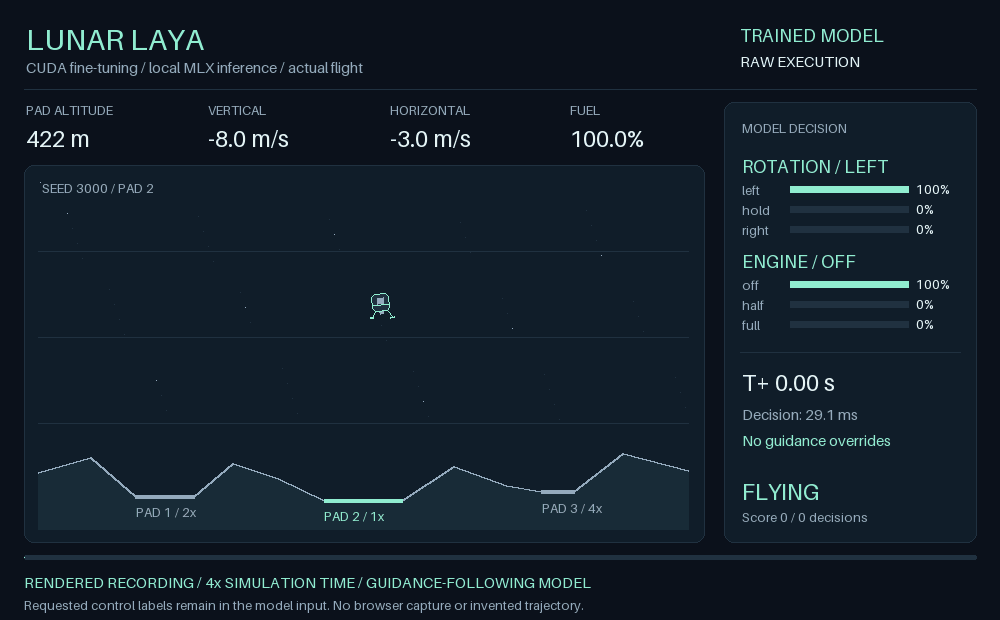

# Lunar Laya

An Atari-inspired lunar landing experiment with **Laya typed decisions running
locally on Apple MLX**, deterministic arcade physics, and a self-contained
browser flight recorder. Watch rotation, engine power, fuel, terrain contact,
model probabilities, and guidance interventions on the same timeline.

**Now includes an additional CUDA-trained Laya checkpoint and a VanillaJS
mission-control SPA.** The trained model landed 30/30 held-out local MLX flights
without post-inference assistance, following explicit guidance requests.
The original checkpoint and modes remain unchanged. See
[training details and limitations](docs/training.md).



Actual FP16 trained-model recording, seed 3000, played at 4× simulation time.
See [GIF reproduction and provenance](docs/media.md) and
[low-memory native MLX deployment](docs/mlx-optimization.md).

This is a new simulation inspired by **Atari's 1979 vector arcade Lunar Lander**,
not an Atari ROM emulator, a Gymnasium LunarLander wrapper, or the LayaAir game
engine. Laya here means Convai Innovations' decision model. MLX runs its neural
inference; the small physics loop runs in ordinary Python.

## Documentation map

| Guide | Read it for |
|---|---|
| [User guide](docs/user-guide.md) | Installation choices, every command-line option, replay controls, telemetry, offline use, and troubleshooting |
| [Implementation](docs/implementation.md) | Data flow, equations, units, terrain, contact rules, guidance, model interface, and recording schema |
| [Developer and experiment guide](docs/development.md) | Python API examples, replay regeneration, result analysis, reproducibility, testing, and changing the controller |
| [Validation](docs/validation.md) | Actual model and baseline outcomes, latency measurement boundaries, reproduction commands, and verification limits |
| [Validation data](docs/validation.json) | Machine-readable summaries from the measured runs |
| [Training and MLX deployment](docs/training.md) | Additional three-GPU supervised training, splits, hyperparameters, export, local evaluation and reproduction |
| [Training results](docs/training-results.json) | Training history, backend parity and 30 held-out flight summaries |
| [MLX memory optimization](docs/mlx-optimization.md) | Compact native runtime, quantization candidates, measured memory, accuracy and reproduction |
| [Animated flight](docs/media.md) | GIF, source provenance, rendering details and reproduction |
| [VanillaJS SPA](web/README.md) | Build, serve, use and test the multi-view demonstration application |

## Open the mission-control SPA

With the matched recordings generated in this workspace:

```bash
python3 web/build.py dist/baseline-demo.json dist/pretrained-demo.json \
  dist/assisted-demo.json dist/trained-demo.json
python3 -m http.server 8766 --bind 127.0.0.1 --directory dist/web
```

Open **http://127.0.0.1:8766/**. The VanillaJS SPA includes a flight deck,
controller comparison, decision probabilities, telemetry, timeline controls and
recording downloads. No npm install or frontend build framework is needed.
It displays recorded experiments; it does not run neural inference in JavaScript.
See the [SPA guide](web/README.md) for fresh-checkout instructions.

For the existing local demonstration, open `dist/assisted.html`. Compare it with
`dist/raw.html` and `dist/baseline.html`. These generated files contain complete
recordings and are ignored by source control; a fresh checkout must generate
its own using the commands below.

## Try a landing immediately

The baseline needs only Python 3.11+; no model, package installation or GPU:

```bash
python3 -m lunar_laya --pilot baseline
open dist/replay.html                       # macOS; otherwise open in a browser
```

The replay has play/pause, restart, timeline scrubbing, speed and episode
selection. It opens directly from disk and uses no CDN, server, or npm packages.
It replays a completed flight; it is not a live or keyboard-playable game.

## Run Laya on MLX

Use an **Apple Silicon Mac, macOS 14+, and Python 3.11+** (Python 3.12 is used
for this project's validation). Install [uv](https://docs.astral.sh/uv/), then:

```bash
uv venv --python 3.12
uv pip install -e '.[mlx]'
.venv/bin/lunar-laya --pilot assisted --out dist/assisted.json --replay dist/assisted.html
open dist/assisted.html
```

The MLX extra pins the Laya-MLX implementation to a Git commit. The first model
load downloads `aac6fef/laya-multilingual-mlx` from Hugging Face (hundreds of MB).
Subsequent loads reuse the cache. There is no cloud inference or text generation.
For the sibling development checkout listed in `AGENTS.md`, use this instead:

```bash
uv pip install -e ../laya-mlx -e .
```

The default public model is not lunar-flight fine-tuned. Guidance computes desired flight
corrections and supplies explicit requested rotation/power labels alongside
telemetry. Laya translates that structured task into two `choice` answers.
This is **guidance-conditioned decision following**, not a claim that a language
model has independently discovered orbital mechanics or learned a flight policy.

The additional model was fine-tuned on that guidance-following task on `training-host`
using GPUs 0–2. To select the trained local export explicitly:

```bash
HF_HUB_OFFLINE=1 .venv/bin/lunar-laya --pilot laya \
  --model ./models/lunar-laya-supervised-mlx --seed 3000 --episodes 3 \
  --out dist/trained-local.json --replay dist/trained-local.html
```

The trained weights are a local, ignored artifact; they are not included in the
source package. [Training documentation](docs/training.md) explains reproduction
and transfer. Omitting `--model` still selects the original public checkpoint.

For the validated low-memory deployment, use the additional
`./models/lunar-laya-q6` checkpoint with the same command. It uses native MLX
6-bit weights and sequential choices. Export instructions and the measured
accuracy/memory tradeoff are in [MLX optimization](docs/mlx-optimization.md).

| Pilot | Decision path | Meaning of a successful landing |
|---|---|---|
| `baseline` | Guidance → controls | Checks physics and deterministic feedback; no model loaded |
| `laya` | Guidance + telemetry → Laya → controls | Tests unshielded model execution of guidance requests |
| `assisted` (default) | Same Laya call, then replace every disagreement with guidance | Demonstrates integration; final trajectory equals baseline |

Every Laya decision records its probabilities, original proposal, executed
command, whether assistance intervened, and end-to-end decision latency.
**Assisted landing rate is not evidence of model piloting skill.** Compare raw
execution and intervention rate on the same seeds to evaluate Laya.

```bash
# Paired multi-episode experiment; seeds 0 through 9, central pad.
.venv/bin/lunar-laya --pilot baseline --episodes 10 --out dist/baseline.json --replay dist/baseline.html
.venv/bin/lunar-laya --pilot laya --episodes 10 --out dist/raw.json --replay dist/raw.html
.venv/bin/lunar-laya --pilot assisted --episodes 10 --out dist/assisted.json --replay dist/assisted.html

# Narrow, higher-scoring pad; target indices are 0, 1, 2.
.venv/bin/lunar-laya --pilot assisted --target 2 --seed 42

# Finite integration smoke test (reports truncated, not landed, if still flying).
.venv/bin/lunar-laya --pilot laya --steps 5

# Local weights; no download if the directory is complete.
HF_HUB_OFFLINE=1 .venv/bin/lunar-laya --model ./models/laya-multilingual-mlx

# Pin weights separately from runtime source for reproducibility.
.venv/bin/lunar-laya --model aac6fef/laya-multilingual-mlx --revision MODEL_COMMIT
.venv/bin/lunar-laya --help
```

Output files are replaced when reusing their names. Each JSON contains the
resolved model location/revision, installed runtime versions, initial seed,
world geometry, every transition, and per-episode summaries. See the
[implementation guide](docs/implementation.md) for the schema, equations,
assistance policy, collision rules, and how to extend the experiment.

## What is implemented

- Fixed-step gravity and thrust, finite fuel, fuel-limited rotation, inertia,
  three flat landing pads, sloped terrain, touchdown checks and score multipliers.
- Seeded initial position, velocity and attitude; finite episodes and explicit
  landed/crashed/out-of-bounds/timeout/truncated outcomes.
- Actual Laya-MLX inference with two typed choices and no generated JSON;
  the compact runtime processes choices sequentially to reduce memory.
- A deterministic controller and an explicit assistance mode for comparison.
- Offline vector-style flight replay with state, commands and model probabilities,
  drawn between decisions rather than only on them: a recorded frame covers one
  0.2 s control stage, so redrawing only at stage boundaries animates at 5 fps.
  The flight deck mixes the state a stage ended in back into the one it started
  from and redraws every animation frame, which leaves the drawn lander at most
  one stage behind the telemetry panel while the panel keeps reporting exact
  decision states.
- A chamfered-box lander shared byte for byte with
  [lunar-mpc](https://github.com/mraad/lunar-mpc) and
  [lunar-mpc-laya](https://github.com/mraad/lunar-mpc-laya), in the SPA and in
  the GIF renderer. Its coordinates are in units of `RADIUS / 8` with y pointing
  down, so the footpads sit exactly one hull radius below the centre and touch
  the surface at touchdown at any canvas size.

The original arcade game has variable thrust, rotation controls, fuel management
and scored landings. Atari also describes abort and mission selection controls.
This implementation keeps the core descent problem, but uses its own units,
terrain and tolerances, three engine levels for Laya, a single-flight fuel budget,
and a 180-second simulation cap. It omits coins, abort, sound, automatic camera
zoom, original difficulty modes and repeated arcade rounds. No Atari assets,
ROMs or disassembled game code are distributed. Sources:
[Atari's original manual](https://www.crazykong.com/manuals/LunarLander.man.pdf)
and [Atari Coin Connection, October 1979](https://elibrary.arcade-museum.com/Atari-Coin-Connection/1979-October-3-08/1).

## Validate and understand

```bash
python3 -m unittest discover -s tests -v
node tests/test_replay.cjs                    # optional Node; no packages needed
node web/app.test.cjs
python3 -m lunar_laya --pilot baseline --episodes 30
```

Tests cover integration, fuel exhaustion, partial burns, contact limits, pad
scoring, terminal absorption, seeded landings, model-to-action mapping, assistance,
recording continuity and safe HTML embedding. Fake-model unit tests check the
adapter contract, not actual model accuracy. Actual inference needs the MLX
extra and checkpoint. Recorded validation and limitations are in
[docs/validation.md](docs/validation.md).

```text
lunar_laya/game.py       simulation, state and landing rules
lunar_laya/pilot.py      feedback guidance, prompts and Laya-MLX adapter
lunar_laya/cli.py        episode runner, provenance, JSON and HTML export
lunar_laya/replay.html   standalone canvas replay and telemetry interface
tests/test_lunar.py      dependency-free regression checks
docs/                   implementation and measured validation
training/               additional supervised CUDA training and MLX verification
web/                    VanillaJS SPA (shared lander art, stage interpolation), builder and playback tests
```

Reference projects: [Laya](https://github.com/NandhaKishorM/laya),
[Laya-MLX](https://github.com/mizorewww/laya-mlx), and the adjacent
`../lunar-mpc` project. Laya-MLX is used as a dependency rather than copying the
neural runtime. The lunar-mpc separation of simulator, controller and recorded
replay informed the organization; this project uses original physics and
feedback code, not its adaptive MPC or Box2D implementation. Laya and Laya-MLX
retain their upstream licenses and model terms. Atari's name identifies the
inspiration; this project is not affiliated with Atari.
